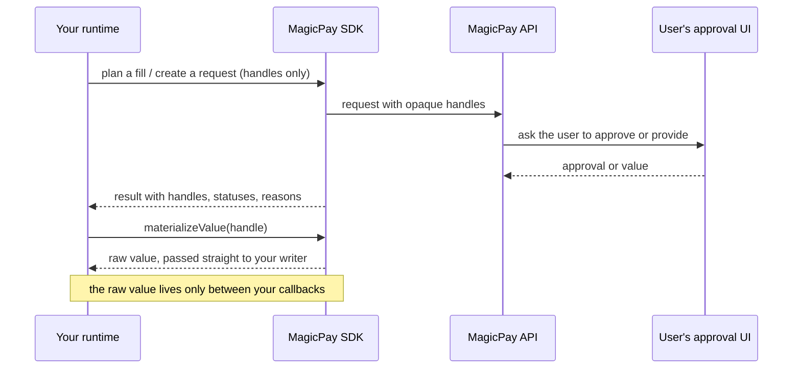

<div align="center">

# MagicPay SDK

**Payments, identity, and human approvals for AI agents —
raw secrets never enter the model's context.**

[](https://www.npmjs.com/package/@nuanu-ai/magicpay-sdk) [](https://www.typescriptlang.org) [](https://nodejs.org) [](#requirements) [](LICENSE.md)

[Getting Started](https://github.com/nuanu-ai/magicpay-sdk/blob/main/docs/getting-started.md) ·
[API Reference](https://github.com/nuanu-ai/magicpay-sdk/blob/main/docs/api-reference.md) ·
[Core Concepts](https://github.com/nuanu-ai/magicpay-sdk/blob/main/docs/concepts.md) ·
[Examples](https://github.com/nuanu-ai/magicpay-sdk/blob/main/examples/README.md) ·
[Changelog](CHANGELOG.md)

</div>

---

Your agent signs in, fills checkout and identity forms, and pays on the user's
behalf. MagicPay holds the user's reusable data and every human approval;
planning runs on opaque handles, and raw values are materialized only between
your own callbacks — never logged, never shown to a model. Your runtime keeps
the agent, the browser, and all provider calls.

```ts
import { createMagicPayClient, getAuthenticatedAgent } from '@nuanu-ai/magicpay-sdk';

const gateway = {
  apiKey: process.env.MAGICPAY_API_KEY!,
  apiUrl: process.env.MAGICPAY_API_URL!,
};

// Step 0: one round trip proves the key works.
const agent = await getAuthenticatedAgent(gateway);
console.info(`Authenticated as ${agent.name} (status: ${agent.status})`);

// Then a client owns sessions, Memory, approvals, and waiting.
const client = createMagicPayClient({ gateway });
```

## How it works



## What you can do

- **Read and save reusable Memory** — `client.memoryItems` is CRUD over saved
  records; `client.memory` asks the user and waits for the answer.
- **Fill any trusted target from runtime-only handles** — API headers, provider
  SDK calls, or browser fields; filling never submits, pays, or books.
- **Detect provider-backed payment cards** that need the user's payment
  authorization before card handles can be revealed.
- **Ask the user to confirm an action or choose an option** and wait for the
  result without writing polling code.

The SDK talks to the MagicPay API. Browser observation, UI, final business
steps, and any provider calls remain in your runtime.

## Core concepts

The model the rest of this README assumes (full version in
[Core Concepts](https://github.com/nuanu-ai/magicpay-sdk/blob/main/docs/concepts.md)):

- **Session** — the container for one workflow; create it, then complete it.
- **Request** — a waitable, human-in-the-loop task. Your runtime creates and
  waits; the user's MagicPay UI answers. A local `waitForResult` timeout is not
  terminal.
- **Handles, not values** — planning and catalogs carry opaque handles; raw
  values are materialized only inside your callbacks, never logged or sent to a
  model.
- **Two "handles"** — a _request handle_ goes to `waitForResult(...)`; a _Memory
  value handle_ (a string) goes to `materializeValue(...)`.
- **Fill is not commit** — fill helpers write values into targets but never
  submit, pay, or book. Final commitment is a separate `client.actions` request.

## Install

```bash
npm i @nuanu-ai/magicpay-sdk
```

Create an API key at
[`app.magiccard.ai/signup`](https://app.magiccard.ai/signup); the API base URL
for your workspace comes with it. Export both as `MAGICPAY_API_KEY` and
`MAGICPAY_API_URL` — the
[Getting Started](https://github.com/nuanu-ai/magicpay-sdk/blob/main/docs/getting-started.md)
guide shows the current values.

## Requirements

- Node.js >= 18.
- ESM only. There is no CommonJS build, so `require('@nuanu-ai/magicpay-sdk')`
  fails. CommonJS callers must use dynamic
  `await import('@nuanu-ai/magicpay-sdk')`.
- TypeScript 5.x with `"moduleResolution"` set to `"node16"`, `"nodenext"`, or
  `"bundler"`. Older resolution modes do not read the package `exports` map.

## Versioning

This package is still `0.x`. Minor versions may include breaking changes until
`1.0`. Pin an exact version and re-check the release notes before upgrading.

## Entrypoints

| Entrypoint                                  | Purpose                                                                                             |
| ------------------------------------------- | --------------------------------------------------------------------------------------------------- |
| `@nuanu-ai/magicpay-sdk`                 | Root client for sessions, Memory, Memory requests, actions, choices, and request waiting.           |
| `@nuanu-ai/magicpay-sdk/core`            | Lower-level helpers such as Memory catalog fetch and runtime materialization.                       |
| `@nuanu-ai/magicpay-sdk/fill-plan-apply` | Target-agnostic Memory fill helpers: `fillMemoryValue(...)`, `applyFill(...)`, and `planFill(...)`. |
| `@nuanu-ai/magicpay-sdk/magicsearch`     | MagicSearch client helpers.                                                                         |

## Quick Start

### Step 0 — verify your key

`getAuthenticatedAgent(...)` reads the agent your API key belongs to. Make it
the first call in a new integration: a wrong key, a revoked key, or the wrong
API base URL fails here, in one round trip, instead of somewhere inside a
session flow.

```ts
import {
  getAuthenticatedAgent,
  getMagicPayErrorMessage,
  isMagicPayRequestErrorStatus,
} from '@nuanu-ai/magicpay-sdk';

try {
  const agent = await getAuthenticatedAgent({
    apiKey: process.env.MAGICPAY_API_KEY!,
    apiUrl: process.env.MAGICPAY_API_URL!,
  });

  console.info(`Authenticated as ${agent.name} (status: ${agent.status})`);
} catch (error) {
  if (isMagicPayRequestErrorStatus(error, 401)) {
    throw new Error(`MagicPay rejected the API key: ${getMagicPayErrorMessage(error)}`);
  }

  throw error;
}
```

The runnable version — env vars, readable failure, non-zero exit — is
[`examples/hello-world.ts`](https://github.com/nuanu-ai/magicpay-sdk/blob/main/examples/hello-world.ts).

### Step 1 — create a session and ask the user

```ts
import { createMagicPayClient } from '@nuanu-ai/magicpay-sdk';

const client = createMagicPayClient({
  gateway: {
    apiKey: process.env.MAGICPAY_API_KEY!,
    apiUrl: process.env.MAGICPAY_API_URL!,
  },
});

const { session } = await client.sessions.create({
  type: 'payment',
  description: 'Book a flight',
  merchantName: 'Airline Example',
});

const handle = await client.memory.createRequest(session.id, {
  clientRequestId: 'airline-login-email-1',
  kind: 'memory.provide_missing',
  fields: [{ key: 'email', label: 'Email', required: true, type: 'email' }],
  context: {
    url: 'https://airline.example.com/login',
    merchantName: 'Airline Example',
  },
});

const result = await client.memory.waitForResult(session.id, handle);

if (!result.ok) {
  switch (result.reason) {
    case 'denied':
      // The user refused. A business outcome, not a failure.
      await yourRuntime.continueWithoutSavedEmail();
      break;
    case 'timeout':
      // Local waiter timeout only — the request is still open in the user's
      // MagicPay UI. Keep the request id and resume waiting from any process.
      await yourRuntime.resumeRequestLater(session.id, result.requestId);
      break;
    default:
      // 'expired' | 'failed' | 'canceled' are terminal.
      throw new Error(`Memory request ${result.reason}`);
  }
} else if (result.artifact.kind === 'reference') {
  await yourRuntime.continueWithMemoryReference(result.artifact.reference);
} else {
  throw new Error(`Unexpected artifact kind: ${result.artifact.kind}`);
}
```

Memory request results return references, not reusable raw values. Only
`denied`, `expired`, `failed`, and `canceled` are terminal; `timeout` means the
local waiter gave up, not the user — see
[Waiting for results](https://github.com/nuanu-ai/magicpay-sdk/blob/main/docs/api-reference.md#waiting-for-results).

## Memory Fill

Use the fill helpers when your runtime has a Memory handle and needs to write
the current-run value into a trusted target. The target can be an API request,
a provider SDK call, a database write, or a browser field. Raw values are not
returned from the helper results and should not be sent to model prompts.

### Fill One Known Handle

Use `fillMemoryValue(...)` when your code already knows the handle. The value
exists only inside your `materializeValue` and `write` callbacks.

```ts
import { materializeMemoryValues } from '@nuanu-ai/magicpay-sdk/core';
import { fillMemoryValue } from '@nuanu-ai/magicpay-sdk/fill-plan-apply';

await fillMemoryValue({
  handle: 'handle_api_token',
  materializeValue: async (handle) => {
    const response = await materializeMemoryValues(client.gateway, session.id, [handle]);
    const entry = response.values.find((value) => value.handle === handle);
    if (!entry || entry.status !== 'ready') {
      throw new Error(`Memory handle is not ready: ${handle}`);
    }
    return String(entry.value ?? entry.text ?? '');
  },
  write: async (value) => {
    const expected = `Bearer ${value}`;
    request.headers.authorization = expected;
    return request.headers.authorization === expected
      ? { status: 'filled', verification: { verified: true, strategy: 'exact' } }
      : { status: 'blocked', reason: 'postcondition_mismatch' };
  },
});
```

`write` must re-read the destination and return value-free verification. A
void or unverified result fails closed and is never recorded as complete.
Browser-backed writers that need resumable persistence should also return a
`scope` captured immediately after that write: current `pageRef`,
`documentRef`, and a screened origin+pathname `pageUrl`. Unscoped completions
remain valid for one-shot SDK use but cannot authorize CLI resume.

### Apply A Ready Plan

Use `applyFill(...)` when your runtime already has a `FillPlan`. The plan can
come from your own code, a stored artifact, or `planFill(...)`. The plan must
contain handles, not raw values.

```ts
import { materializeMemoryValues } from '@nuanu-ai/magicpay-sdk/core';
import { applyFill, type FillPlan } from '@nuanu-ai/magicpay-sdk/fill-plan-apply';

const plan: FillPlan = {
  id: 'api-auth-plan',
  valueVisibility: 'handles_only',
  targetSetFingerprint: 'api-request-v1',
  fields: [
    {
      targetRef: 'authorization-header',
      fieldName: 'authorization',
      fieldRef: 'api.bearer_token',
      state: 'ready',
      valueHandle: 'handle_api_token',
    },
  ],
  blockers: [],
  finalCommitmentTargets: [],
};

const applyResult = await applyFill({
  plan,
  currentTargetState: { fingerprint: 'api-request-v1' },
  materializeValue: async (handle) => {
    const response = await materializeMemoryValues(client.gateway, session.id, [handle]);
    const entry = response.values.find((value) => value.handle === handle);
    if (!entry || entry.status !== 'ready') {
      throw new Error(`Memory handle is not ready: ${handle}`);
    }
    return String(entry.value ?? entry.text ?? '');
  },
  targetWriter: {
    async write({ value }) {
      const expected = `Bearer ${value}`;
      request.headers.authorization = expected;
      return request.headers.authorization === expected
        ? { status: 'filled', verification: { verified: true, strategy: 'exact' } }
        : { status: 'blocked', reason: 'postcondition_mismatch' };
    },
  },
});
```

### Plan, Then Apply

Use `planFill(...)` when you want the SDK to build the `FillPlan` from a
value-free Memory catalog, your target descriptors, and Memory target matches.
Provider-backed payment cards are not returned as ordinary catalog handles
until payment authorization succeeds in the active session. Before approval,
the catalog keeps `valueVisibility: 'handles_only'` and reports the card under
`unavailable` with `availability.status: 'authorization_required'`.

Each target is a `FillTargetDescriptor`. It is free text by default; set
`writeCapability` to `{ kind: 'choice', options }` for a select target,
`{ kind: 'toggle' }` for a checkbox or switch, or
`{ kind: 'unavailable', reason }` for one that cannot be written.

```ts
import { fetchMemoryCatalog, materializeMemoryValues } from '@nuanu-ai/magicpay-sdk/core';
import { applyFill, planFill } from '@nuanu-ai/magicpay-sdk/fill-plan-apply';

const targetSet = {
  fingerprint: 'login-form-v1',
  targets: [{ targetRef: 'email', label: 'Email', fieldName: 'email' }],
  context: { url: 'https://airline.example.com/login' },
};

const catalog = await fetchMemoryCatalog(client.gateway, session.id, targetSet.context.url);

const plan = await planFill({
  sessionId: session.id,
  targetSet,
  targetMatches: [
    {
      status: 'matched',
      targetRef: 'email',
      fieldRef: 'profile.email',
      fieldName: 'email',
      confidence: 'high',
    },
  ],
  memoryCatalog: catalog,
});

const paymentCardBlocker = plan.blockers.find(
  (blocker) =>
    blocker.kind === 'payment_card.authorization_required' &&
    blocker.status === 'authorization_required'
);

if (paymentCardBlocker) {
  await yourRuntime.collectPaymentFactsAndAuthorizePayment();
}

const applyResult = await applyFill({
  plan,
  currentTargetState: {
    fingerprint: targetSet.fingerprint,
    targets: targetSet.targets,
  },
  materializeValue: async (handle) => {
    const response = await materializeMemoryValues(client.gateway, session.id, [handle]);
    const value = response.values.find((entry) => entry.handle === handle);
    if (!value || value.status !== 'ready') {
      throw new Error(`Memory handle is not ready: ${handle}`);
    }
    return String(value.value ?? value.text ?? '');
  },
  targetWriter: {
    async write(input) {
      await yourBrowser.fill(input.targetRef, input.value);
      const observed = await yourBrowser.readValue(input.targetRef);
      return observed === input.value
        ? { status: 'filled', verification: { verified: true, strategy: 'exact' } }
        : { status: 'blocked', reason: 'postcondition_mismatch' };
    },
  },
});

if (applyResult.status !== 'filled' && applyResult.status !== 'partial') {
  throw new Error(applyResult.status);
}
```

## Main Client Surface

- `client.memoryItems.list({ url })` lists value-free Memory item records for the current site; use `{ allSites: true }` only for explicit global review.
- `client.memoryItems.get(itemId)` reads one value-free Memory item by stable item id.
- `client.memoryItems.create(...)` creates a Memory item with human-readable field labels.
- `client.memoryItems.update(itemId, ...)` patches an existing Memory item. Address existing fields by `fieldRef`, not by label.
- `client.memoryItems.delete(itemId)` soft-deletes one editable Memory item.
- A Memory item is a user-owned reusable record with a human-readable label and
  related fields. Use labels like `Airline login`, `Traveler profile`,
  `Home shipping address`, or `Facts about user`; do not put raw values in the
  label.
- Field labels are human display and matcher evidence, not stable identity.
  Use `fieldRef` for existing-field updates and deletes.
- Memory item fields may include `valueType` / `value_type` when the stored
  value should be normalized for projection. Public editable value types are
  `date`, `phone_number`, and `person_name`. Omit the type for ordinary direct
  fill. Card value types are internal provider-backed fill types and are not
  accepted by public Memory CRUD.
- `secret` / `isSecret` is mutable display and logging metadata for a field. It
  is not a value type and not an encryption mode.
- `client.memory.createRequest(sessionId, input)` creates a Memory request.
- `client.memory.submitDecision(sessionId, requestId, input)` submits a Memory decision.
- `client.memory.claim(sessionId, requestId)` claims a completed Memory request.
- `client.memory.waitForResult(sessionId, handle)` waits and claims.
- `client.actions.run(...)` and `client.actions.waitForResult(...)` handle user-confirmed actions.
- `client.choice.request(...)` and `client.choice.waitForResult(...)` handle option selection.
- `client.requests.waitForStatus(sessionId, handle, { mode: 'follow_request' })`
  observes one exact request without claiming it. The shared defaults are a
  three-second cadence, 15-second safe heartbeats, 90 seconds of observation
  grace after request expiry, and a 35-minute client safety ceiling. It returns
  typed pending results for a diagnostic timeout, abort, server-deadline
  overrun, or client safety deadline; these are not terminal decisions.
  Server expiry governs only `waiting_user`; persisted `approved`/`executing`
  work ignores the original approval expiry and remains resumable under the
  independent 35-minute client safety deadline. Each observation composes the
  caller abort signal and uses the smaller of the existing five-minute
  transport ceiling and the remaining logical deadline.
- `client.requests.waitForResult(...)` waits on non-Memory request handles.
- `client.sessions.*` creates, reads, describes, and completes workflow sessions.

Use `follow_request` for agent handoffs. Preserve the request id and resume the
same poll after a host interruption. After either safety deadline, reconcile
once with the API and report a still-overdue request rather than starting
another unbounded poll or creating a replacement request. A browser action and
a user-request poll are separate operations: finish or return from the browser
operation before starting the standalone poll, so a browser action's wall-clock
deadline cannot kill an approval already in progress.

See [Getting Started](https://github.com/nuanu-ai/magicpay-sdk/blob/main/docs/getting-started.md), [API Reference](https://github.com/nuanu-ai/magicpay-sdk/blob/main/docs/api-reference.md),
and [Examples](https://github.com/nuanu-ai/magicpay-sdk/blob/main/docs/examples.md) for the full integration guide.
